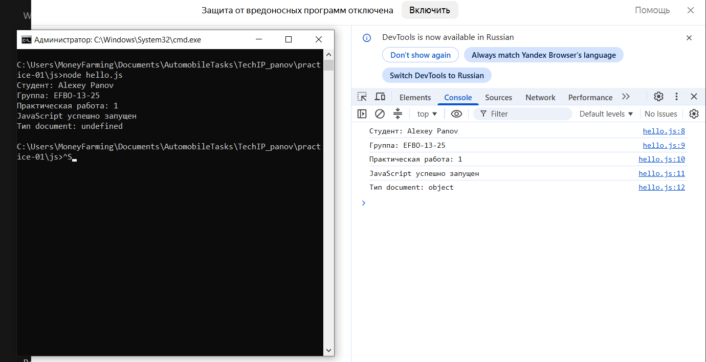

# Практическая работа № 1

**Тема:** подготовка окружения и первые программы на JavaScript
**Автор:** Панов Алексей, группа ЭФБО-13-25
**Вариант:** 5

Мой номер в журнале — 21, поэтому вариант считал по формуле: `((21 − 1) % 8) + 1 = 5`. Данные варианта: `totalTasks = 7`, `completedTasks = 2`, `dailyLimit = 2`.

## Окружение

| Компонент | Версия |
|---|---|
| ОС | Windows 10 (10.0.19045) |
| Node.js | v24.20.0 (ветка 24 LTS) |
| npm | 12.0.2 |
| Git | 2.55.0.windows.3 |
| Браузер | Chrome 153.0.8010.52 |

Версии получил командами `node --version`, `npm --version`, `git --version`.

## Запуск

Все команды набираю из корня репозитория:

```bash
node practice-01/js/hello.js
node practice-01/js/types.js
node practice-01/js/progress.js
node practice-01/js/plan.js
node practice-01/js/debug.js
node practice-01/js/progress-input.js   # дополнительное задание
```

Чтобы посмотреть файл в браузере, открываю `practice-01/index.html`, при необходимости меняю путь в `<script src="...">` на нужный файл, сохраняю и перезагружаю страницу. Вывод смотрю во вкладке Console в инструментах разработчика.

## Задание 1. Один файл — две среды

Запустил один и тот же `hello.js` сначала через Node.js, потом в Chrome. В терминале вывелось:

```text
Студент: Alexey Panov
Группа: EFBO-13-25
Практическая работа: 1
JavaScript успешно запущен
Тип document: undefined
```

В браузере все строки те же, кроме последней: там `Тип document: object`.

Разница в том, что `document` — объект браузера, через него скрипт достаётся до HTML-страницы. Node.js никакую страницу не создаёт, у него этого объекта просто нет, поэтому `typeof document` возвращает `undefined`. В обоих случаях вывод оказался именно в консоли, сама страница при этом не изменилась.

## Задание 2. Типы и преобразования

Перед запуском записал, что думаю по поводу каждого выражения, потом сверил с консолью. В одном месте ошибся.

| Выражение | Ожидание до запуска | Факт | Тип результата | Объяснение |
|---|---|---|---|---|
| `"8" + 2` | `"82"`, string | `82` | string | Если хоть один операнд у плюса — строка, он склеивает: двойка превратилась в `"2"` и приклеилась к восьмёрке. |
| `"8" - 2` | `6`, number | `6` | number | У минуса строкового режима нет, `"8"` превратилась в число 8. |
| `Number("8") + 2` | `10`, number | `10` | number | Строку сначала явно превратил в число, дальше обычное сложение. |
| `"12" > "3"` | `false`, boolean | `false` | boolean | Строки сравниваются посимвольно, а не как числа: `"1"` меньше `"3"`, значит `"12"` меньше. |
| `12 === "12"` | `false`, boolean | `false` | boolean | Строгое сравнение типы не приводит, число и строка сразу неравны. |
| `Number("")` | NaN, number — ошибся | `0` | number | Ждал NaN, а пустая строка превращается в ноль. Из-за этого пустой ввод легко пропустить как «ноль задач». |
| `Number("text")` | NaN, number | `NaN` | number | Строка не преобразуется, но тип NaN всё равно number, поэтому его ловят отдельно через `Number.isNaN()`. |
| `Boolean("false")` | `true`, boolean | `true` | boolean | Любая непустая строка даёт true, даже если в ней написано слово «false». |
| `typeof null` | `"object"`, string | object | string | Старая особенность языка: null — примитив, но typeof отвечает `"object"`. Само же значение выражения — строка, поэтому тип результата string. |
| `typeof NaN` | `"number"`, string | number | string | NaN относится к числовому типу. Значение выражения — строка `"number"`, её тип — string. |

После этих опытов понятно, почему в задании 3 данные я проверяю через `Number.isInteger()` и `Number.isFinite()`, а не через `typeof`: он и для null, и для NaN выдаёт обманчивые ответы, а `Number("")` молча превращает пустоту в ноль.

## Задание 3. Сводка выполнения задач

В файле стоят данные моего варианта (7 и 2). Вывод получился такой:

```text
Всего задач: 7
Выполнено: 2
Осталось: 5
Прогресс: 28.6%
Статус: В работе
```

Процент считаю как `completedTasks / totalTasks * 100` и округляю до одного знака через `toFixed(1)`. Статус беру из исходных количеств, а не из округлённого процента.

Проверки в коде идут по нарастанию: сначала тип, потом NaN, потом целочисленность, потом диапазон 0–1000, и только потом сравнение `completed > total`. Отдельный случай — ноль задач: вывожу «Задач пока нет» и до деления дело не доходит, поэтому NaN от деления на ноль появиться не может.

Таблица проверок (данные менял в константах между запусками):

| Проверка | Входные данные | Что ждал | Что вывелось | Итог |
|---|---|---|---|---|
| Мой вариант | `7`, `2` | Осталось 5, 28.6%, «В работе» | Вывод выше | Пройдено |
| Обычный случай | `12`, `5` | Осталось 7, 41.7%, «В работе» | Так и есть | Пройдено |
| Нет задач | `0`, `0` | «Задач пока нет», без процента | Одна строка «Задач пока нет» | Пройдено |
| Ничего не сделано | `5`, `0` | 0.0%, «Не начато» | `Прогресс: 0.0%`, `Статус: Не начато` | Пройдено |
| Всё сделано | `5`, `5` | 100.0%, «Завершено» | `Прогресс: 100.0%`, `Статус: Завершено` | Пройдено |
| Сделал больше, чем есть | `5`, `6` | Ошибка | `Ошибка: выполнено больше задач, чем всего существует` | Пройдено |
| Отрицательное число | `-1`, `0` | Ошибка | `Ошибка: количество задач должно быть в диапазоне от 0 до 1000` | Пройдено |
| Дробное число | `5`, `2.5` | Ошибка | `Ошибка: количество задач должно быть целым числом` | Пройдено |
| Строка вместо числа | `"5"`, `2` | Ошибка | `Ошибка: количество задач должно быть передано числом` | Пройдено |
| Слишком много задач | `1001`, `0` | Ошибка | `Ошибка: количество задач должно быть в диапазоне от 0 до 1000` | Пройдено |
| NaN на входе | `NaN`, `0` | Ошибка | `Ошибка: недопустимое числовое значение` | Пройдено |

## Задание 4. План по дням

Считаю только оставшиеся задачи (`total − completed`). В цикле `while` на каждый день беру `Math.min(dailyLimit, остаток)` и вычитаю его из остатка. `Math.min` нужен ради последнего дня: выполнить больше, чем осталось, нельзя, поэтому остаток никогда не уходит в минус. Для моего варианта (7, 2, 2) вывод такой:

```text
Осталось задач: 5
День 1: выполнено 2, осталось 3
День 2: выполнено 2, осталось 1
День 3: выполнено 1, осталось 0
Потребуется дней: 3
```

Цикл не может зациклиться: остаток уменьшается хотя бы на единицу за шаг, а проверка `dailyLimit` (целое от 1 до 1000) стоит ещё до цикла, так что нулевая норма до цикла просто не дойдёт.

| Проверка | Входные данные | Что ждал | Что вывелось | Итог |
|---|---|---|---|---|
| Мой вариант | `7`, `2`, `2` | 3 дня, в последний — 1 | Вывод выше | Пройдено |
| Пример из методички | `12`, `5`, `3` | 3 дня, в последний — 1 | Дни 3/3/1, 3 дня | Пройдено |
| Делится ровно | `10`, `4`, `3` | 2 дня по 3 | Дни 3/3, 2 дня | Пройдено |
| Норма больше остатка | `5`, `3`, `10` | 1 день, сделано 2 | `День 1: выполнено 2, осталось 0` | Пройдено |
| Всё уже сделано | `5`, `5`, `2` | 0 дней, цикл не крутится | `Все задачи уже выполнены`, `Потребуется дней: 0` | Пройдено |
| Задач нет | `0`, `0`, `2` | 0 дней | `Задач пока нет`, `Потребуется дней: 0` | Пройдено |
| Нулевая норма | `5`, `2`, `0` | Ошибка | `Ошибка: дневная норма должна быть целым числом от 1 до 1000` | Пройдено |
| Дробная норма | `5`, `2`, `1.5` | Ошибка | `Ошибка: значения должны быть целыми числами` | Пройдено |
| Выполнено больше, чем есть | `5`, `6`, `2` | Ошибка | `Ошибка: некорректное количество задач` | Пройдено |
| Норма строкой | `5`, `2`, `"2"` | Ошибка | `Ошибка: все значения должны быть переданы числами` | Пройдено |
| Норма больше границы | `5`, `2`, `1001` | Ошибка | `Ошибка: дневная норма должна быть целым числом от 1 до 1000` | Пройдено |

## Задание 5. Поиск ошибок через DevTools

Сначала записал вывод исходной версии с ошибками:

```text
Выполнено: 32
Осталось: -24
Контрольная сумма: 6
```

Программа не падала и ошибок в консоли не было, но числа явно не те: по условию должно быть 5, 3 и 10.

Открывал файл в браузере через `index.html`, во вкладке Sources поставил точку останова на строке, где считается `completedTotal`. После перезагрузки страницы в Scope было видно, что `completedText` и `additionalText` — строки `"3"` и `"2"`, а не числа. Сделал шаг Step over — и `completedTotal` стал строкой `"32"`: плюс склеил строки. Вторую точку останова поставил внутри цикла: `taskNumber` прошёл значения 1, 2, 3, после чего условие `4 < 4` оказалось ложным и цикл вышел — задачу номер 4 в сумму так и не взяли.

| Ошибка | Что наблюдалось | Причина | Исправление | Результат |
|---|---|---|---|---|
| Обработка количеств | `Выполнено: 32`, `Осталось: -24` | Операнды — строки, плюс их склеил, а вычитание потом превратило в `-24` | Явное `Number(completedText) + Number(additionalText)` | `Выполнено: 5`, `Осталось: 3` |
| Граница цикла | `Контрольная сумма: 6` (1+2+3) | Условие `taskNumber < 4` останавливает цикл на тройке | Условие заменено на `taskNumber <= 4` | `Контрольная сумма: 10` |

Скриншот останова на точке: 

В `js/debug.js` оставлена исправленная версия, значения в ответах не прописывал руками — расчёты на месте.

## Дополнительное задание. Вариант А — вход строками

Файл `js/progress-input.js`: количества приходят строками, у меня `"7"` и `" 2 "`. Сначала проверяю, что пришли именно строки (так отсеиваются `null` и `undefined`), потом `trim()`, потом отбрасываю пустую строку, и только затем `Number()` и вся валидация из задания 3.

Свои проверки:

| Входные данные | Что ждал | Что вывелось | Итог |
|---|---|---|---|
| `"7"`, `" 2 "` | Как в задании 3: 28.6%, «В работе» | Так и есть | Пройдено |
| `"12"`, `"5"` | 41.7%, «В работе» | Совпало | Пройдено |
| `"abc"`, `"2"` | Ошибка без падения | `Ошибка: строку не удалось преобразовать в число` | Пройдено |
| `""`, `"5"` | Ошибка | `Ошибка: получена пустая строка` | Пройдено |
| `"2.5"`, `"1"` | Ошибка | `Ошибка: значения должны быть целыми числами` | Пройдено |
| `"Infinity"`, `"0"` | Ошибка | `Ошибка: число должно быть конечным` | Пройдено |
| `null`, `"2"` | Ошибка | `Ошибка: входные данные должны быть строками` | Пройдено |
| `undefined`, `"1"` | Ошибка | `Ошибка: входные данные должны быть строками` | Пройдено |
| `"8"`, `"9"` | Ошибка | `Ошибка: значения вне допустимого диапазона` | Пройдено |

Почему нельзя обойтись `Number()` и проверкой «не отрицательно»: `Number("")` даёт ноль, и пустой ввод прошёл бы как «ноль задач». `Number("Infinity")` даёт бесконечность — она неотрицательная и прошла бы. `Number("abc")` даёт NaN, а сравнение `NaN < 0` ложно, то есть NaN проскочил бы проверку как «нормальное значение». Плюс `null` и `undefined` вообще не строки, и их надо отсеять до преобразования.

## Вывод

В работе я настроил окружение и прошёл весь цикл: написал код, запустил в двух средах, прогнал обычные, граничные и заведомо неверные данные, нашёл две логические ошибки отладчиком и зафиксировал всё в Git. Разобрался с `const` и `let`, типами и их преобразованиями, строгим сравнением, условиями и циклом `while`.

Больше всего запомнилась ошибка из задания 5: `"3" + "2"` спокойно выдало `"32"`, и программа завершилась без единого сообщения об ошибке — просто с неправильным ответом. После неё я запомнил главное: отсутствие ошибок в консоли ещё не значит, что программа считает правильно, поэтому результат надо сверять с ожидаемым, а не только смотреть, упало или нет.
